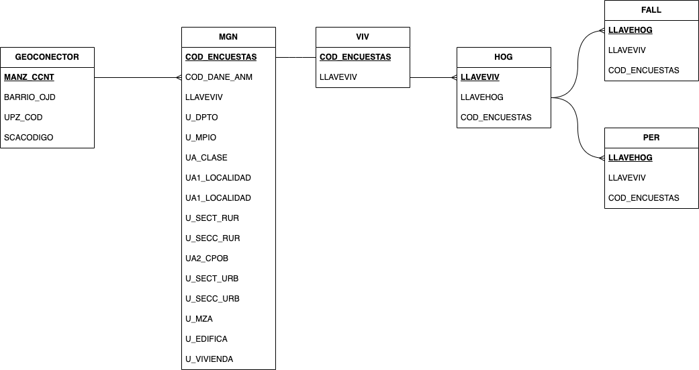

# Ejercicio de visualización de datos georreferenciados: extracción, cruce y análisis de datos del DANE, IDECA-UAECD y OJD*

Jorge Luis González–Castellanos**

<h6>
* Los derechos patrimoniales de este trabajo pertenecen a la Pontificia Universidad Javeriana, Bogotá. El uso de los productos aquí consignados, identificados con las siglas OJD, debe ser realizado bajo estricta autorización de dicha institución.

</h6>

<h6>

**Estudiante de pregrado en sociología. Universidad Nacional de Colombia, Sede Bogotá

</h6>

<h6>

**Participante voluntario del Observatorio Javeriano de las Desigualdades. Pontificia Universidad Javeriana, Bogotá

</h6>

## Sobre este producto 

En este repositorio se consignan los productos del ejercicio de visualización de datos censales con base en mi trabajo de investigación personal con fuentes abiertas de datos, proceso autónomo realizado durante los años 2022 y 2023. 

Los productos aqui publicados se obtuvieron de fuentes abiertas y oficiales (DANE, IDECA-UAECD), y como parte de mi trabajo voluntario con el Observatorio Javeriano de las Desigualdades (OJD). 

Sobre la última fuente, dadas las condiciones de posibilidad, se toma la decisión de subir aquí esta y todas las cartografías necesarias para el dashboard realizado, mayormente basado en mis trabajos académicos previos.

Figura 1. Ejemplo del modelo de datos del dashboard con variables elementales. Elaboración propia basado en fuentes: DANE, IDECA-UAECD.

[Pulse aquí para ir al informe preliminar (Dashboard de Power BI)](https://app.powerbi.com/view?r=eyJrIjoiYjJjODVhYjYtOTNlNi00MDQzLTlhY2QtZDI1N2VkZjk3ZjFmIiwidCI6IjU3N2ZjMWQ4LTA5MjItNDU4ZS04N2JmLWVjNGY0NTVlYjYwMCIsImMiOjR9&pageName=8e7c7264545ce0d79024&navContentPaneEnabled=false)

## Fuentes Oficiales: 

Departamento Administrativo Nacional de Estadística: www.dane.gov.co

Catastro Bogotá: https://www.catastrobogota.gov.co/datos-abiertos.
